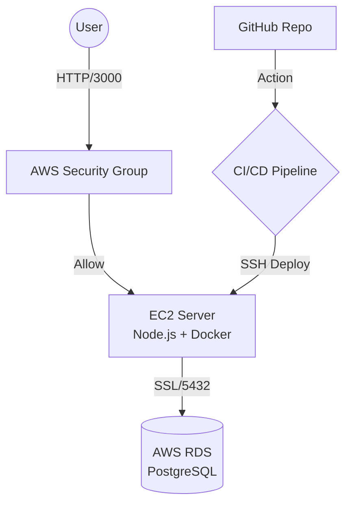

# ☁️ Cloud-Native E-Commerce API (Enterprise Edition)

**A Production-Ready Inventory System deployed on AWS EC2 using Docker, PostgreSQL, and CI/CD.**

This project demonstrates a robust hybrid-cloud architecture connecting **Node.js (Express)**, **AWS EC2**, and **AWS RDS (PostgreSQL)**, fully containerized with **Docker** and automated via **GitHub Actions**.

## 🏗 Architecture
The system follows a containerized hybrid-cloud pattern:



## 🚀 Key Features
* **📦 Containerized Logic:** Fully Dockerized application ensures 100% consistency between local development and the production EC2 server.
* **🛡️ ACID Transactions:** Uses raw SQL transaction logic (`BEGIN`, `COMMIT`, `ROLLBACK`) to prevent stock overselling during high-concurrency events.
* **🔥 Zero-Downtime Deployment:** Automated **GitHub Actions** pipeline updates the live server immediately upon code push.
* **🔒 Enterprise Security:** Implemented "Least Privilege" access using AWS Security Groups and enforced **SSL encryption** for database connections.
* **💾 Managed Persistence:** Data is stored in **AWS RDS (PostgreSQL)** for scalability and reliability.

## 🛠 Tech Stack
| Component | Technology | Role |
| :--- | :--- | :--- |
| **Backend** | Node.js v18 (Express) | RESTful API Logic |
| **Compute** | AWS EC2 (Ubuntu) | Hosting Server |
| **Database** | AWS RDS (PostgreSQL) | Relational Data Storage |
| **Container** | Docker | Environment Isolation |
| **DevOps** | GitHub Actions | CI/CD Automated Deployment |
| **Security** | SSL / Security Groups | Network & Data Protection |

## 📸 Project Highlights

### 1. The Infrastructure (Hybrid Cloud)
I moved beyond simple local databases. This project provisions a real Linux Server (**EC2**) for compute and connects it securely to a managed Relational Database Service (**RDS**). This mimics a real-world enterprise environment where compute and storage are decoupled.

### 2. The Data Integrity (SQL Transactions)
Instead of basic CRUD operations, I implemented **ACID-compliant transactions**. When an order is placed:
1.  The system locks the specific product row.
2.  Checks stock levels.
3.  Deducts stock and creates the order record simultaneously.
4.  Commits the change only if all steps succeed, preventing data corruption.

### 3. The Automation (CI/CD)
Manual SSH deployments are error-prone. I built a **GitHub Actions pipeline** that:
1.  Detects changes in the `main` branch.
2.  SSHs into the EC2 instance using encrypted secrets.
3.  Pulls the latest code and rebuilds the Docker container.
4.  Restarts the application automatically.

## 🚀 How to Run Locally

### Prerequisites
* Docker & Docker Compose
* Node.js v18+

### Installation
1.  Clone the repository.
2.  Create a `.env` file with your credentials:
    ```env
    DB_HOST=localhost
    DB_USER=postgres
    DB_PASSWORD=your_password
    DB_NAME=postgres
    ```
3.  Start the container:
    ```bash
    docker build -t shop-api .
    docker run -p 3000:3000 --env-file .env shop-api
    ```
4.  Access the API at `http://localhost:3000/products`.

## 📡 API Endpoints

### Products
* `GET /products` - List all inventory.
* `POST /products` - Add new stock.
    ```json
    { "name": "Cloud Hoodie", "price": 49.99, "stock_quantity": 50 }
    ```

### Orders
* `POST /orders` - Purchase an item (Decrements stock safely).
    ```json
    { "product_id": 1, "quantity": 2 }
    ```

---
*Built by Joriel Espinocilla as a showcase of Cloud Engineering skills.*